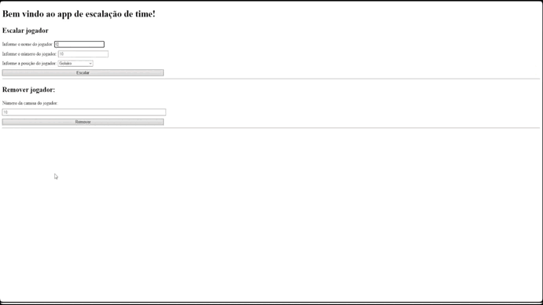

# Escalador de times

App desenvolvido para treinar meus conhecimentos em JS básico e DOM, nessa aplicação você pode escalar seu time com até 11 jogadores e excluir também caso queira. Foi utilizado principalmente HTML e JS, já o CSS utilizei somente flex-box para não ficar muito feio visualmente. Qualquer melhoria ou sugestão que queira oferecer, um pull request será totalmente bem-vindo! 👊

## Stack utilizada

**Front-end:** HTML, CSS, JS

## Demonstração

